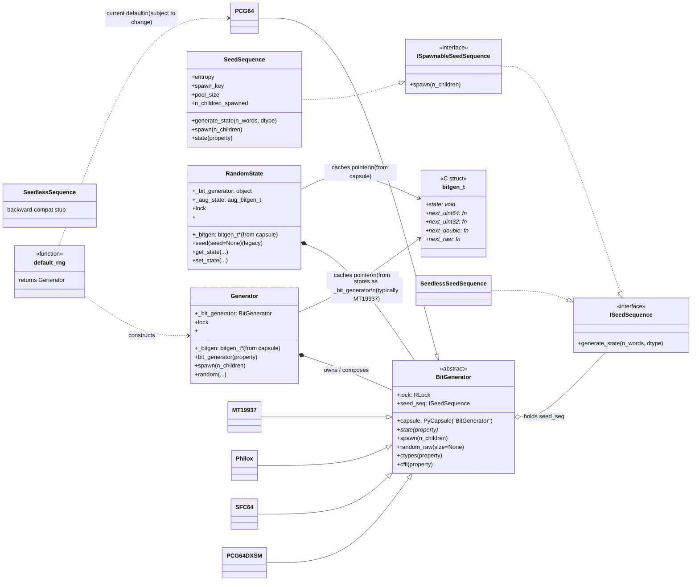

```mermaid
classDiagram
direction LR

class Generator {
  +_bit_generator: BitGenerator
  +_bitgen: bitgen_t*        (from capsule)
  +lock
  +bit_generator (property)
  +spawn(n_children)
  +random(...)
  +<many distribution methods>
}

class BitGenerator {
  <<abstract>>
  +capsule: PyCapsule("BitGenerator")
  +lock: RLock
  +seed_seq: ISeedSequence
  +state (property)*
  +spawn(n_children)
  +random_raw(size=None)
  +ctypes (property)
  +cffi (property)
}

class SeedSequence {
  +entropy
  +spawn_key
  +pool_size
  +n_children_spawned
  +generate_state(n_words, dtype)
  +spawn(n_children)
  +state (property)
}

class ISeedSequence {
  <<interface>>
  +generate_state(n_words, dtype)
}

class ISpawnableSeedSequence {
  <<interface>>
  +spawn(n_children)
}

class SeedlessSeedSequence
class SeedlessSequence

class RandomState {
  +_bit_generator: object
  +_bitgen: bitgen_t* (from capsule)
  +_aug_state: aug_bitgen_t
  +lock
  +seed(seed=None)  (legacy)
  +get_state(...)
  +set_state(...)
  +<legacy distribution methods>
}

class PCG64
class MT19937
class Philox
class SFC64
class PCG64DXSM

class bitgen_t {
  <<C struct>>
  +state: void*
  +next_uint64: fn*
  +next_uint32: fn*
  +next_double: fn*
  +next_raw: fn*
}

%% Relationships (modern)
Generator *-- BitGenerator : owns / composes
Generator --> bitgen_t : caches pointer\n(from BitGenerator.capsule)
BitGenerator o-- ISeedSequence : holds seed_seq
SeedSequence ..|> ISpawnableSeedSequence
ISpawnableSeedSequence ..|> ISeedSequence

%% Seedless variants used for specific cases
SeedlessSeedSequence ..|> ISeedSequence
SeedlessSequence : backward-compat stub

%% Concrete BitGenerators
PCG64 --|> BitGenerator
MT19937 --|> BitGenerator
Philox --|> BitGenerator
SFC64 --|> BitGenerator
PCG64DXSM --|> BitGenerator

%% Legacy
RandomState *-- BitGenerator : stores as _bit_generator\n(typically MT19937)
RandomState --> bitgen_t : caches pointer\n(from capsule)

%% Default construction notes
class default_rng {
  <<function>>
  returns Generator
}
default_rng ..> Generator : constructs
default_rng ..> PCG64 : current default\n(subject to change)
```